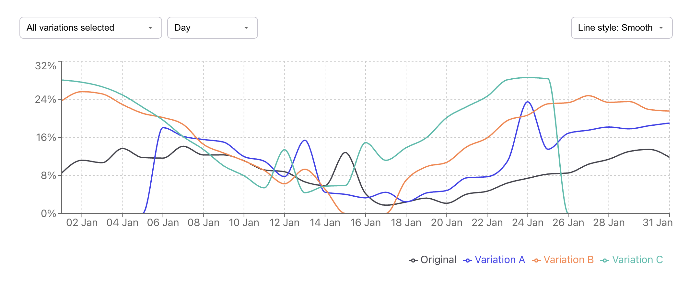

# A/B Test Dashboard

Интерактивная линейная диаграмма для визуализации статистики A/B-тестирования.  
Проект позволяет анализировать конверсию разных вариаций, переключаться между дневной и недельной агрегацией данных, выбирать отображаемые вариации и менять стиль графиков.

**Демо**: https://katerina-99.github.io/ab-test-chart/

[](https://katerina-99.github.io/ab-test-chart/)

---

## Функциональность

### Управление отображением

- Переключение агрегации: **Day / Week** (недели начинаются с понедельника)
- Выбор вариаций (Original, Variation A, B, C…) — можно показывать несколько одновременно
- Выбор стиля линии: **Line**, **Smooth**, **Area**
- Полностью кастомные контролы (без нативных `<select>`)

### График

- Отображает **Conversion Rate** для выбранных вариаций
- Разные цвета для каждой вариации
- Адаптивный tooltip:
  - при дневной агрегации — обычная дата
  - при недельной — диапазон `03 Jan 2025 – 09 Jan 2025`
- Ось X при недельной агрегации: `03 Jan – 09 Jan`

### Агрегация по неделям

- Автоматическая группировка данных
- Корректный пересчёт Conversion Rate за неделю
- Понятное форматирование дат

## Используемые технологии

- **React**
- **TypeScript**
- **Recharts** для графиков
- **CSS Modules**
- Vite
- GitHub Actions для деплоя
- GitHub Pages для хостинга

## Как запустить локально

```bash
# 1. Клонировать репозиторий
git clone https://github.com/Katerina-99/ab-test-chart.git
cd ab-test-chart

# 2. Установить зависимости
npm install

# 3. Запустить dev-сервер
npm run dev
```

Откройте http://localhost:5173 (порт может отличаться)
